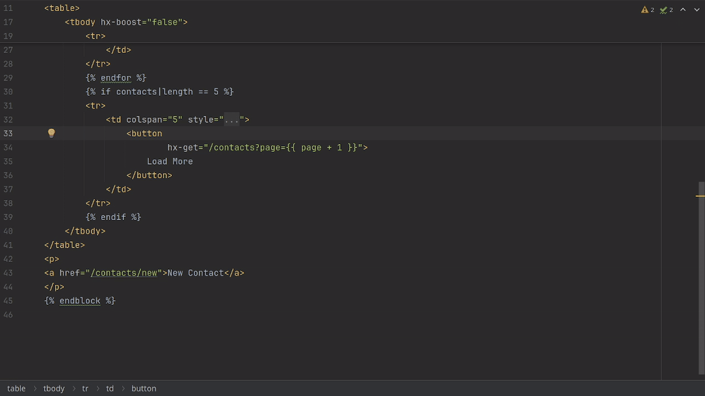

## HTMX Pro plugin

**This is the public issue tracker for HTMX Pro plugin.**

**HTMX Pro** plugin provides comprehensive support for the [htmx](https://htmx.org) library in JetBrains IDEs.

- Provides advanced coding assistance, including syntax highlighting, code completions, and inspections for htmx attributes and values
- Supports HTML and various templating languages, including JSX and TSX
- Enables JavaScript and CSS language features within selected htmx attributes in supported editors

[EULA](eula.md)